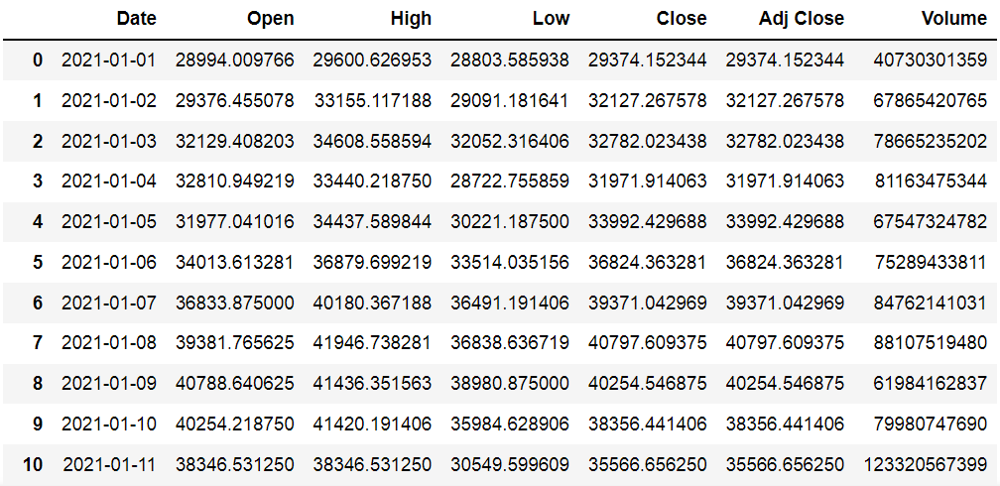
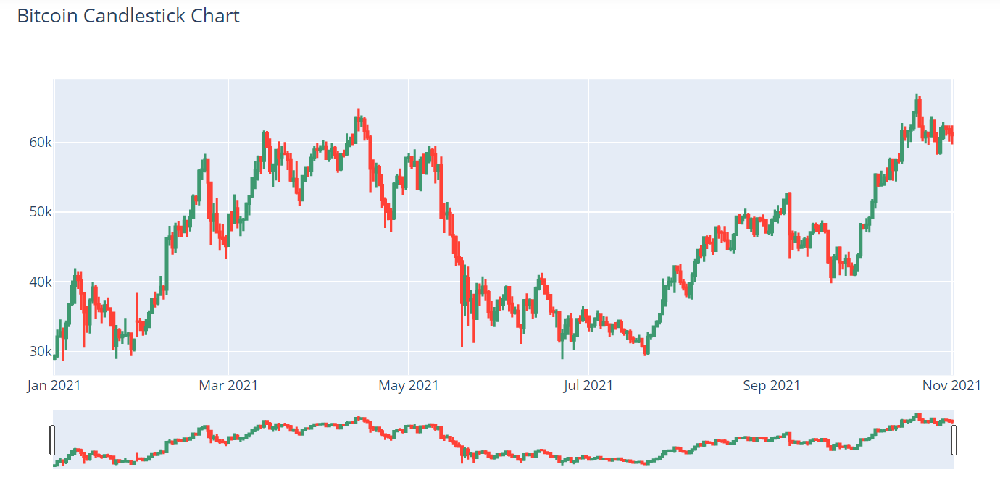
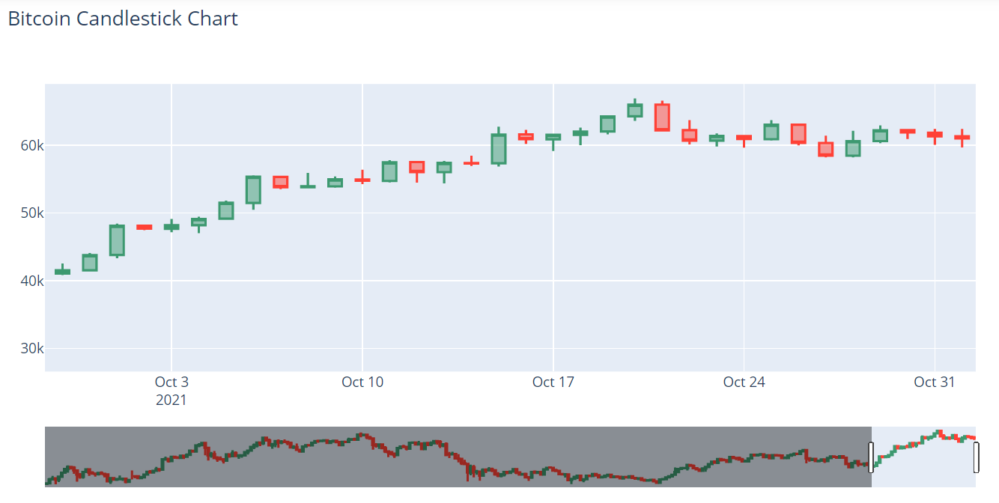
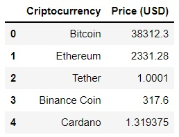

# Cryptocurrencies

# PART 1: Bitcoin prices: candlestick chart
* Get Bitcoin prices data.
* Construct a candlestick chart of Bitcoin prices.

## Code and Resources Used 
**Python Version:** 3.7  
**Packages:** time, datetime, pandas, plotly 

## Bitcoin prices
DataFrame of Bitcoin prices of 2021: date, high, low, open, close, volume (volume of Bitcoin negotiated on that day), adjusted close (adjusted close price of Bitcoin on that day).

## Candlestick chart
When operating cryptocurrencies, one important chart that helps the analysis is the candlestick, mainly in trading. A candlestick is a type of price chart used in technical analysis that displays the high, low, open, and closing prices of a security for a specific period of time. 

Bitcoin prices:

[LINK to animated plot](https://chart-studio.plotly.com/~melisadigiacomo/15)  

### Reading a candlestick chart
Each candle consists of a body and the wicks. The body of the candle indicates the prices at the time of opening and closing during the time span of the candle. The lines that extend from the upper and lower body are the highlights. These represent the highest and lowest prices that the asset reached during the listing period.  
**Green** candles show **rising prices**, so the open is at the bottom of the body and the close is at the top. **Red** candles show **declining prices**, so the open is at the top of the body and the close is at the bottom.

Zoom in October prices:

  

# PART 2: Prices of Top Cryptocurrencies
* Created a tool that returns a table with prices of the top criptocurrencies.
* Scraped website using python.
* Built and save a table with the data.

## Code and Resources Used 
**Python Version:** 3.7  
**Packages:** pandas, requests, bs4 

## Web Scraping
Tweaked a web scraper to scrape top cryprocurrencies from investing.com.
*	Top Cryptocurrencies
*	Prices (USD)
 
## Displaying Data
After scraping the data, I displayed the information on a table and exported it.

